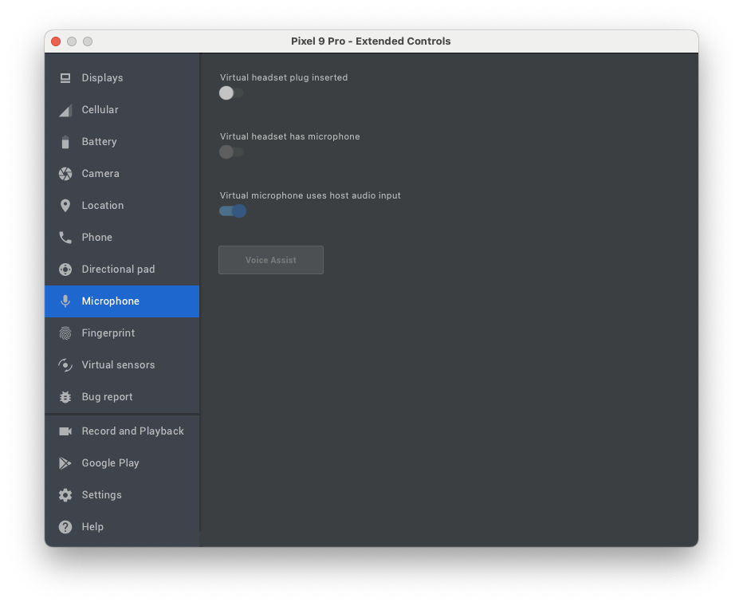

## ElevenLabs Conversational AI SDK for Android (Kotlin)

Official ElevenLabs Conversational SDK for Android.

### Features

- Audio‑first, low‑latency sessions over LiveKit (WebRTC)
- Public agents (token fetched client‑side from agentId) and private agents (pre‑issued conversationToken)
- Strongly‑typed events and callbacks (connect, messages, mode changes, feedback availability, unhandled client tools)
- Data channel messaging (user message, contextual update, user activity/typing)
- Feedback (like/dislike) associated with agent responses
- Microphone mute/unmute control

---

## Installation

Add Maven Central and the SDK dependency to your Gradle configuration.

### settings.gradle.kts
```kotlin
pluginManagement {
    repositories {
        gradlePluginPortal()
        google()
        mavenCentral()
    }
}

dependencyResolutionManagement {
    repositoriesMode.set(RepositoriesMode.FAIL_ON_PROJECT_REPOS)
    repositories {
        google()
        mavenCentral()
    }
}
```

### app/build.gradle.kts
```kotlin
dependencies {
    // ElevenLabs Conversational AI SDK (Android)
    implementation("io.elevenlabs:elevenlabs-android:<latest>)

    // Kotlin coroutines, AndroidX, etc., as needed by your app
}
```

---

## Permissions

Add microphone permission to your `AndroidManifest.xml`:
```xml
<uses-permission android:name="android.permission.RECORD_AUDIO" />
<uses-permission android:name="android.permission.INTERNET" />
<uses-permission android:name="android.permission.ACCESS_NETWORK_STATE" />
```

Request runtime permission before starting a voice session. Camera permission is NOT required by this SDK.

---

## Quick Start

Start a conversation session with either:
- Public agent: pass `agentId`
- Private agent: pass `conversationToken` provisioned from your backend (never ship API keys).

### Kotlin (Application/Activity)
```kotlin
import io.elevenlabs.ConversationClient
import io.elevenlabs.ConversationConfig
import io.elevenlabs.ConversationSession
import io.elevenlabs.ClientTool
import io.elevenlabs.ClientToolResult

// Start a public agent session (token generated for you)
val config = ConversationConfig(
    agentId = "<your_public_agent_id>", // OR conversationToken = "<token>"
    userId = "your-user-id",
    // Optional callbacks
    onConnect = { conversationId ->
        // Connected, you can store conversationId via session.getId() too
    },
    onMessage = { source, messageJson ->
        // Raw JSON messages from data channel; useful for logging/telemetry
    },
    onModeChange = { mode ->
        // "speaking" | "listening" — drive UI indicators
    },
    onStatusChange = { status ->
        // "connected" | "connecting" | "disconnected"
    },
    onCanSendFeedbackChange = { canSend ->
        // Enable/disable thumbs up/down
    },
    onUnhandledClientToolCall = { call ->
        // Agent requested a client tool not registered on the device
    },
    onVadScore = { score ->
        // Voice Activity Detection score, range from 0 to 1 where higher values indicate higher confidence of speech
    }
    // List of client tools the agent can invoke
    clientTools = mapOf(
        "logMessage" to object : ClientTool {
            override suspend fun execute(parameters: Map<String, Any>): ClientToolResult? {
                val message = parameters["message"] as? String

                Log.d("ExampleApp", "[INFO] Client Tool Log: $message")
                return ClientToolResult.success("Message logged successfully")
            }
        }
    ),
)

> **Note:** If a tool is configured with `expects_response=false` on the server, return `null` from `execute` to skip sending a tool result back to the agent.

// In an Activity context
val session: ConversationSession = ConversationClient.startSession(config, this)

// Send messages via the data channel
session.sendUserMessage("Hello!")
session.sendContextualUpdate("User navigated to the settings screen")
session.sendUserActivity() // useful while user is typing

// Feedback for the latest agent response
session.sendFeedback(isPositive = true) // or false

// Microphone control
session.toggleMute() // toggle
session.setMicMuted(true) // explicit

// Conversation ID
val id: String? = session.getId() // e.g., "conv_123" once connected

// End the session
session.endSession()
```

---

## Public vs Private Agents

- **Public agents** (no auth): Initialize with `agentId` in `ConversationConfig`. The SDK requests a conversation token from ElevenLabs without needing an API key on device.
- **Private agents** (auth): Initialize with `conversationToken` in `ConversationConfig`. Issued by your server (your backend uses the ElevenLabs API key). **Never embed API keys in clients.**

---

## Callbacks Overview

- **onConnect(conversationId: String)**: Fired once connected. Conversation ID can also be read via `session.getId()`.
- **onMessage(source: String, message: String)**: Raw JSON messages from data channel. `source` is `"ai"` or `"user"`.
- **onModeChange(mode: String)**: `"speaking"` or `"listening"`; drive your speaking indicator.
- **onStatusChange(status: String)**: `"connected" | "connecting" | "disconnected"`.
- **onCanSendFeedbackChange(canSend: Boolean)**: Enable/disable feedback buttons.
- **onUnhandledClientToolCall(call)**: Agent attempted to call a client tool not registered on the device.
- **onVadScore**: Voice Activity Detection score. Ranges from 0 to 1 where higher values indicate confidence of speech.

---

## Client Tools (optional)

Register client tools to allow the agent to call local capabilities on the device.
```kotlin
val config = ConversationConfig(
    agentId = "<public_agent>",
    clientTools = mapOf(
        "logMessage" to object : io.elevenlabs.ClientTool {
            override suspend fun execute(parameters: Map<String, Any>): io.elevenlabs.ClientToolResult? {
                val message = parameters["message"] as? String ?: return io.elevenlabs.ClientToolResult.failure("Missing 'message'")
                android.util.Log.d("ClientTool", "Log: $message")
                return null // No response needed for fire-and-forget tools
            }
        }
    )
)
```

When the agent issues a `client_tool_call`, the SDK executes the matching tool and responds with a `client_tool_result`. If the tool is not registered, `onUnhandledClientToolCall` is invoked and a failure result is returned to the agent (if a response is expected).

---

## User activity and messaging

- `session.sendUserMessage(text: String)`: user message that should elicit a response from the agent
- `session.sendContextualUpdate(text: String)`: context that should not prompt a response from the agent
- `session.sendUserActivity()`: signal that the user is typing/active

---

## Feedback

Use `onCanSendFeedbackChange` to enable your thumbs up/down UI when feedback is allowed. When pressed:
```kotlin
session.sendFeedback(isPositive = true)  // like
session.sendFeedback(isPositive = false) // dislike
```
The SDK ensures duplicates are not sent for the same/older agent event.

---

## Mute / Unmute

```kotlin
session.toggleMute()
session.setMicMuted(true)   // mute
session.setMicMuted(false)  // unmute
```

Observe `session.isMuted` to update the UI label between “Mute” and “Unmute”.

---

## Example App

This repository includes an example app demonstrating:
- One‑tap connect/disconnect
- Speaking/listening indicator
- Feedback buttons with UI enable/disable
- Typing indicator via `sendUserActivity()`
- Contextual and user messages from an input
- Microphone mute/unmute button

Run:
```bash
./gradlew example-app:assembleDebug
```

Install the APK on an emulator or device (note: emulators may have audio routing limitations). Use Android Studio for best results.

### Emulator permissions

Ensure to allow the virtual microphone to use host audio input in the emulator settings.



---

## ProGuard / R8

If you shrink/obfuscate, ensure Gson models and LiveKit are kept. Example rules (adjust as needed):
```proguard
-keep class io.elevenlabs.** { *; }
-keep class io.livekit.** { *; }
-keepattributes *Annotation*
```

---

## Troubleshooting

- Ensure microphone permission is granted at runtime
- If reconnect hangs, verify your app calls `session.endSession()` and that you start a new session instance before reconnecting
- For emulators, verify audio input/output routes are working; physical devices tend to behave more reliably
